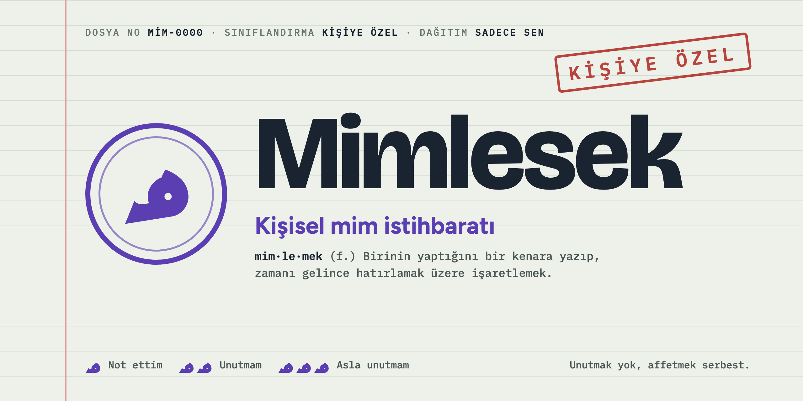
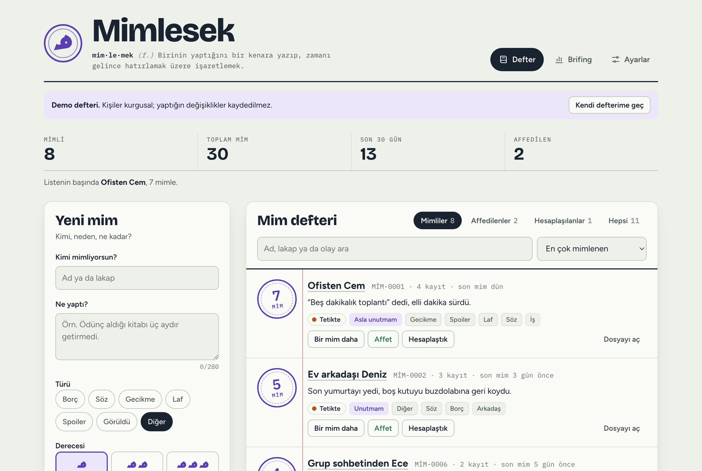
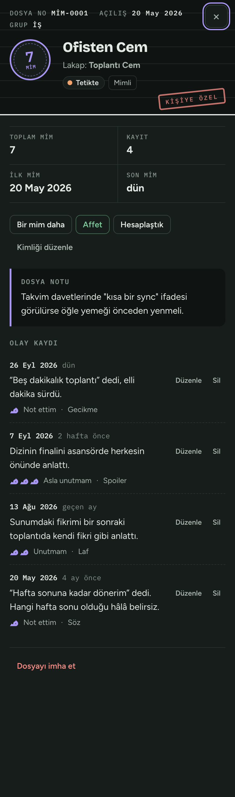
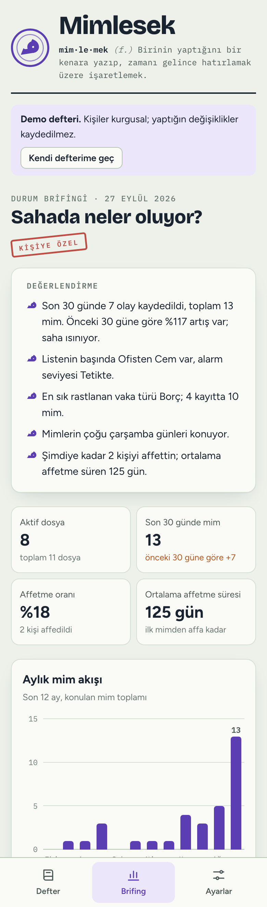

<p align="center">
  
</p>

<p align="center">
  <b>GİZLİLİK DERECESİ:</b> Kişiye özel &nbsp;·&nbsp;
  <b>DAĞITIM:</b> Sadece sen &nbsp;·&nbsp;
  <b>İMHA TALİMATI:</b> Okuduktan sonra yıldız ver
</p>

<p align="center">
  <a href="https://gorkemguler.github.io/mimlesek/"><b>Uygulamayı aç</b></a> ·
  <a href="https://gorkemguler.github.io/mimlesek/?demo">Demo defterini gez (web)</a> ·
  <a href="https://github.com/gorkemguler/mimlesek/releases/latest">Masaüstü ve Android</a> ·
  <a href="#sahaya-iniş">Kurulum</a> ·
  <a href="#sıkça-sorulan-sorgulamalar">SSS</a>
</p>

<p align="center">
  
  
  
  
  
  
  
</p>

---

## Brifing

> **Konu:** Kimin ne yaptığını unutmamak.
> **Durum:** Aktif.
> **Tehdit seviyesi:** Ev arkadaşının son yumurtayı yiyip yemediğine bağlı.

Herkesin hayatında biri vardır. Ödünç aldığı kitabı getirmeyen, "beş dakikaya oradayım" deyip kırk dakika sonra gelen, dizinin finalini asansörde anlatan biri. Normal insanlar bunları unutur. Sen unutmuyorsun. Tebrikler, doğru teşkilattasın.

**Mimlesek**, zihninin arka odalarında dağınık duran bu bilgileri düzenli bir dosyaya koyan kişisel mim istihbaratı uygulamasıdır. Kimi mimlediğini, neden mimlediğini ve olayın ne kadar ciddi olduğunu kaydedersin. Sonra önünde iki yol vardır: **affetmek** ya da **hesaplaşmak**. Üçüncü yol, yani sonsuza kadar kin tutmak, teknik olarak mümkündür ama teşkilatımızca önerilmez.

<p align="center">
  
</p>

## Operasyonel yetenekler

| Birim | Görevi |
|---|---|
| **Mim defteri** | Her kişi için tek dosya. Aynı kişiyi tekrar mimlersen kayıt onun hanesine yazılır; lakabıyla yazsan bile tanınır. |
| **Mim derecesi** | Üç kademe: *Not ettim* (م), *Unutmam* (م م), *Asla unutmam* (م م م). |
| **Alarm seviyesi** | Taze mimler ağır, eskiler hafif basar. Sakin → Dikkat → Tetikte → Kırmızı alarm. |
| **Kişi dosyası** | Dosya no, lakap, grup, dosya notu ve eksiksiz olay kaydı. Her kayıt sonradan düzenlenebilir. |
| **Durum brifingi** | Aylık mim akışı, türlere göre dağılım, "en çok arananlar" ve kendiliğinden yazılan bir durum değerlendirmesi. |
| **Affet / Hesaplaş** | Dosya arşive kalkar. Gerekirse "Yeniden mimle" ile tekrar açılır. İnsanlar değişmez, dosyalar değişir. |
| **Geri al** | Yanlışlıkla imha ettiğin dosya ya da sildiğin kayıt birkaç saniye içinde geri gelir. Sonrası tarih. |
| **Yedek** | JSON olarak dışa aktar, başka cihazda içe aktar. Birleştirir, hiçbir şeyi ezmez. |
| **Parolalı kasa** | İsteğe bağlı parola. Koyarsan defter cihazda AES-256 ile şifrelenir, her açılışta parola sorulur, hareketsiz kalınca kendiliğinden kilitlenir. |
| **Her cephede** | Web, Windows, macOS, Linux ve Android. Aynı defter, aynı mühür, aynı kin. |
| **İnternetsiz çalışma** | Hiçbir sürüm internete muhtaç değil. Masaüstü ve Android ilk andan, web sürümü ilk açılıştan sonra bağlantısız çalışır. Yazı tipleri dahil her şey pakette. |
| **Gece operasyonu** | Açık ve koyu tema, sistem ayarını da izler. |

<table>
  <tr>
    <td width="50%"></td>
    <td width="50%"></td>
  </tr>
  <tr>
    <td align="center"><sub>Kişi dosyası. Kırmızı damga dekoratiftir; hukuki bağlayıcılığı yoktur.</sub></td>
    <td align="center"><sub>Durum brifingi. Saha ısınıyorsa sana söyler.</sub></td>
  </tr>
</table>

## Şifreli kasa

Bazı dosyalar sadece gözlerin içindir. Masaüstü ve Android uygulamaları ilk açılışta seni bir karşılama ekranıyla bekler ve parola koymayı önerir; istersen "Parolasız başla" diyip geçersin. Parolayı sonradan **Ayarlar → Parola** bölümünden de koyabilirsin. Parola koyduğunda:

- Defter, parolandan türetilen bir anahtarla **AES-256-GCM** kullanılarak şifrelenir. Anahtar, **PBKDF2-SHA256** ile 600.000 turda türetilir; kaba kuvvetle deneyen biri her tahmin için bu turların hepsini baştan döner.
- Parolan **hiçbir yere yazılmaz**, anahtar yalnızca defter açıkken bellekte durur. Şifresiz kopya silinir.
- Uygulama her açılışta parola sorar. Seçtiğin süre boyunca dokunulmazsa (varsayılan 5 dakika) defter kendiliğinden kilitlenir. <kbd>L</kbd> tuşu ya da üstteki **Kilitle** düğmesi anında kilitler.
- Parolayı istediğin zaman değiştirebilir ya da kaldırabilirsin.

> **Uyarı:** Parolanı unutursan defteri kimse açamaz. Biz dahil. Teşkilatın arka kapısı yok; çünkü arka kapısı olan kasa, kasa değildir. Düzenli yedek al.

## Mim derecelendirme cetveli

| Derece | İşaret | Kod adı | Örnek vaka |
|:-:|:-:|---|---|
| 1 | م | Not ettim | "Beş dakikalık toplantı" elli dakika sürdü. |
| 2 | م م | Unutmam | Son yumurtayı yedi, boş kutuyu buzdolabına geri koydu. |
| 3 | م م م | Asla unutmam | Dizinin finalini asansörde, herkesin önünde anlattı. |

## Alarm seviyeleri

Her mim, konulduğu günden bu yana geçen süreye göre ağırlıklandırılır. Zaman her şeyin ilacıdır; biz sadece dozunu hesaplıyoruz.

| Mimin yaşı | Ağırlık |
|---|:-:|
| 0–30 gün | ×1 |
| 31–90 gün | ×0,6 |
| 91–365 gün | ×0,3 |
| 1 yıldan eski | ×0,1 |

| Isı | Seviye | Saha yorumu |
|:-:|---|---|
| 0–1,9 | Sakin | Radarda ama sessiz. |
| 2–3,9 | Dikkat | Bir gözün açık uyusun. |
| 4–6,9 | Tetikte | Grup sohbetinde mesajlarını iki kez oku. |
| 7+ | Kırmızı alarm | Bayram ziyaretini yeniden değerlendir. |

## Sahaya iniş

### A planı: Hiçbir şey kurma

[Uygulamayı aç](https://gorkemguler.github.io/mimlesek/). Beğenirsen tarayıcı menüsünden **Ana ekrana ekle**. Uygulama mağazası yok, hesap yok, iz yok.

### B planı: Kendi üssünü kur

```bash
git clone https://github.com/gorkemguler/mimlesek.git
cd mimlesek
npm start
```

Sonra `http://localhost:4173` adresini aç. `npm install` bile gerekmiyor; bu projenin bağımlılığı yok. Node 20 ve üstü yeter.

### C planı: Masaüstü ve Android uygulaması

[Son sürüm sayfasından](https://github.com/gorkemguler/mimlesek/releases/latest) cihazına uygun dosyayı indir:

| Sistem | Dosya | Kurulum |
|---|---|---|
| Windows | `…_x64-setup.exe` ya da `.msi` | Çift tıkla. SmartScreen uyarırsa **Ek bilgi → Yine de çalıştır**. |
| Windows, bağlantısız makine | `…_x64_internetsiz-setup.exe` | Kurulum için de internet istemez; WebView2 içinde gelir (~200 MB). |
| macOS | `…_universal.dmg` | Applications klasörüne sürükle. İlk açılışta **sağ tık → Aç**. |
| Linux | `.AppImage`, `.deb`, `.rpm` | AppImage için `chmod +x` ve çalıştır; ya da paket yöneticinle kur. |
| Android | `…_android.apk` | Telefonda aç, bilinmeyen kaynaklara izin ver, kur. |

Kurulu uygulamalar tertemiz başlar: demo defteri de örnek kayıt da yoktur, GitHub'a ya da başka bir yere hiç bağlanmazlar. İlk açılışta parola koymak isteyip istemediğini sorarlar. Demo defteri yalnızca [web sitesinde](https://gorkemguler.github.io/mimlesek/?demo) yaşar; orası vitrin, burası karargâh.

Paketler imzasız olduğu için Windows ve macOS ilk açılışta "tanımadığım geliştirici" diye uyarır. Haklılar, tanışmıyoruz. Kod açık; içi rahat etmeyen kendisi derleyebilir (bkz. [Teknik şartname](#teknik-şartname)).

Android paketi her sürümde yeni bir anahtarla imzalanır, bu yüzden güncelleme eskisinin üzerine kurulmaz. Güncellemeden önce **Ayarlar → Yedek** ile yedek al, eski uygulamayı kaldır, yenisini kur ve yedeği yükle.

### D planı: Çanta boyu tek dosya

```bash
npm run build
```

`dist/mimlesek.html` oluşur: bütün uygulama tek bir HTML dosyasında. USB belleğe koy, çift tıkla aç. Hazır derlenmiş hâli sitede de duruyor: [mimlesek-tek-dosya.html](https://gorkemguler.github.io/mimlesek/mimlesek-tek-dosya.html).

## Kullanım talimatnamesi

1. **Tespit.** Formda kişinin adını ya da lakabını yaz. Daha önce mimlediysen Mimlesek onu tanır.
2. **Kayıt.** Ne yaptığını yaz, türünü ve derecesini seç, **Mimle** de. Mühür basılır. Sesi yok ama biz yine de *küt* diye duyuyoruz.
3. **Takip.** **Brifing** sekmesinden genel duruma bak. Kırmızı alarmdakiler için gerekli önlemleri al. Derin nefes önerilir.
4. **Kapanış.** Affet ya da hesaplaş. Dosya arşive kalkar ama silinmez. Teşkilat hiçbir şeyi unutmaz; sen istemedikçe.

| Kısayol | İşlev |
|:-:|---|
| <kbd>N</kbd> | Yeni mim |
| <kbd>/</kbd> | Defterde ara |
| <kbd>1</kbd> <kbd>2</kbd> <kbd>3</kbd> | Defter, Brifing, Ayarlar |
| <kbd>L</kbd> | Defteri kilitle (parola varsa) |
| <kbd>Esc</kbd> | Açık dosyayı kapat |

## Sızıntı yok

- Tüm veriler **tarayıcının yerel deposunda** durur. Sunucu yok, hesap yok, çerez yok, analitik yok.
- Mimlediğin kişiye bildirim gitmez. Mimlesek ispiyoncu değildir.
- Uygulama hiçbir ağ isteği yapmaz: veri göndermez, dışarıdan yazı tipi ya da betik bile yüklemez. Yazı tipleri repoda ve her pakette hazır duruyor. Bunu testler de denetliyor (`tests/cevrimdisi.test.mjs`). İnanmıyorsan kaynak kodu oku. Teşkilatımız şeffaflığa inanır; bu işi şeffaf yapan tek teşkilat olabiliriz.
- İnternet gerekmez. Masaüstü ve Android uygulamaları ilk andan, web sürümü ilk açılıştan sonra bağlantısız çalışır. Hava boşluklu (air-gapped) makineler için Windows'un internetsiz kurucusu var. Ajan dediğin, sinyal olmayan yerde de çalışır.
- İstersen defteri parolayla şifreleyebilirsin (bkz. [Şifreli kasa](#şifreli-kasa)).
- Tarayıcı verilerini silersen defter de gider. **Ayarlar → Yedek** ile ara sıra yedek al. İyi ajan sahaya yedeksiz çıkmaz.

## Sıkça sorulan sorgulamalar

**Bu bir fişleme uygulaması mı?**
Hayır. Fişleme başkalarının yaptığı bir şeydir; biz buna *kişisel arşivcilik* diyoruz. Şaka bir yana: Mimlesek içini dökmek için var. Kimseyi teşhir etmek, takip etmek ya da rahatsız etmek için değil.

**Mimlediğim kişi bunu görebilir mi?**
Telefonunu eline vermediğin sürece hayır. Veriler cihazından çıkmaz.

**"Mim" ne demek?**
Arap alfabesinin م harfi. Rivayete göre eski kayıt defterlerinde bir ismin yanına mim konması "bu kişi not edildi" anlamına gelirmiş. Bugün "mimlemek" dediğimizde hâlâ aynı şeyi kastediyoruz. Tek fark, defterin artık cebimizde olması.

**Birden fazla cihazda kullanabilir miyim?**
Bir cihazda yedeği indir, diğerinde yükle. Eşitleme sunucusu yok, çünkü sunucu olursa biri ona bakar.

**Kaç kişiyi mimleyebilirim?**
Tarayıcı deposu dolana kadar, yani birkaç bin dosya. O sayıya ulaşırsan sorun Mimlesek'te olmayabilir.

**Parolamı unuttum. Ne olacak?**
Kilit ekranındaki **Parolamı unuttum** bölümünden kilitli defteri silip sıfırdan başlayabilirsin. Yedeğin varsa geri yüklersin. Yedeğin yoksa, o mimler artık sadece senin hafızanda yaşıyor. Belki de en doğrusu budur.

**Masaüstü uygulaması neden bu kadar küçük?**
Kendi tarayıcısını taşımıyor; işletim sisteminin hazır web görünümünü kullanıyor (Tauri). Casus dediğin az yer kaplar.

**Affettiğim birini tekrar mimleyebilir miyim?**
Evet. Dosya yeniden açılır, eski kayıtlar da yerinde durur.

**Hesaplaşmak ne demek, kavga mı edeceğiz?**
Hayır. Konuştunuz, anlaştınız, dosya kapandı. Hesaplaşmanın en medeni hâli.

**Uygulama neden bu kadar mor?**
Resmî mühürler mor mürekkeple basılır. Biz de ciddi görünmek istedik.

## Teknik şartname

- Uygulamanın kendisi saf HTML, CSS ve JavaScript (ES modülleri). Framework yok, çalışma zamanı bağımlılığı yok.
- Şifreleme tarayıcının yerleşik Web Crypto API'siyle yapılır: PBKDF2-SHA256 (600.000 tur) ve AES-256-GCM.
- Masaüstü ve Android paketleri [Tauri 2](https://tauri.app) ile üretilir. Kabuk yalnızca pencereyi açar ve yedek dosyası için sistemin kaydet/aç pencerelerini sağlar.
- PWA: `manifest.webmanifest` ve `sw.js` sayesinde tarayıcıdan da kurulabilir, çevrimdışı çalışır.
- Testler Node'un yerleşik test koşucusuyla yazıldı: `npm test`.
- `main` dalına her gönderimde GitHub Actions testleri koşar ve siteyi yayınlar. `v*` etiketi gönderildiğinde dört platformun paketlerini derleyip bir sürüme ekler.
- claude.ai Artifact olarak da çalışır; orada defter, her izleyiciye özel bir veritabanı alanında tutulur.

Masaüstü ve Android paketlerini kendin derlemek istersen:

```bash
npm install                 # yalnızca Tauri komut satırı aracı iner
npm run masaustu            # geliştirme penceresi
npm run masaustu:paket      # bu işletim sistemi için kurulum paketi
npx tauri android init      # bir kez: Android projesini oluştur
npm run android:paket       # APK (Android SDK, NDK ve JDK 17 gerekir)
```

Gereken araçlar için [Tauri'nin ön koşullar sayfasına](https://tauri.app/start/prerequisites/) bak: Rust her platformda, Linux'ta `webkit2gtk-4.1`, Windows'ta WebView2 (Windows 10/11'de hazır gelir).

```
mimlesek/
├── index.html              Uygulama iskeleti
├── styles/app.css          Defter kâğıdı, mühür mürekkebi, iki tema
├── src/
│   ├── main.js             Durum, olaylar, görünüm geçişleri
│   ├── model.js            Mim, alarm, dosya no, yedek ve brifing hesapları
│   ├── views.js            Defter satırı, kişi dosyası ve brifing şablonları
│   ├── charts.js           Kütüphanesiz grafikler
│   ├── store.js            Yerel depo, bulut deposu, dosya kaydetme
│   ├── kasa.js             Parolalı kasa: PBKDF2 + AES-GCM
│   ├── demo.js             Kurgusal demo defteri
│   └── util.js             Tarih ve Türkçe biçimlendirme yardımcıları
├── fonts/                  Pakete gömülü yazı tipleri ve OFL lisansları
├── sw.js                   Çevrimdışı çalışma
├── manifest.webmanifest    Ana ekrana ekleme bilgileri
├── src-tauri/              Masaüstü ve Android kabuğu (Rust, Tauri 2)
│   ├── tauri.conf.json     Pencere, güvenlik politikası, paket ayarları
│   ├── capabilities/       Kabuğun web tarafına verdiği izinler
│   └── icons/              Her platform için ikonlar
├── scripts/
│   ├── serve.mjs           Bağımlılıksız yerel sunucu
│   ├── web-paketi.mjs      Paketlere giren web dosyalarını toplar
│   ├── yazi-tipleri.mjs    Yazı tiplerini bir kez indirip fonts/ klasörüne koyar
│   └── tek-dosya.mjs       Tek dosya derleyicisi
└── tests/                  Alan mantığı, şifreleme ve internetsizlik testleri
```

## Teşkilata katılım

Katkı yapmak istersen önce [CONTRIBUTING.md](CONTRIBUTING.md) dosyasını oku. Hata bulduysan [ihbar formunu](https://github.com/gorkemguler/mimlesek/issues/new/choose) doldur. Lütfen ihbarlara gerçek kişilerin adlarını ve mimlerini yapıştırma; issue sayfası Mimlesek kadar ketum değil.

## Etik kurallar

- Mimlesek bir **mizah ve öz farkındalık** aracıdır. Gerçek bir istihbarat servisiyle, herhangi bir kamu kurumuyla ya da resmî kayıt sistemiyle hiçbir ilgisi yoktur.
- İnsanları takip etmek, taciz etmek, kişisel bilgilerini toplamak ya da yaymak için kullanma. Uygulamada bu yüzden adres, telefon, konum ya da fotoğraf alanı yok; olmayacak da.
- En iyi dosya, kapanmış dosyadır. Arada bir **Affet** düğmesine bas. Sağlığına iyi gelir.

## Lisans

[MIT](LICENSE). Kopyala, değiştir, dağıt. Tek şartımız lisans metnini de yanında götürmen. Ajanlar evraksız seyahat etmez.

Yazı tipleri (Bricolage Grotesque, Figtree, IBM Plex Mono, Reem Kufi) SIL Open Font License 1.1 ile dağıtılır; lisans metinleri [`fonts/lisanslar/`](fonts/lisanslar) klasöründe.

---

<p align="center"><sub>Bu belge kendini imha etmeyecek. Ama <code>git rm README.md</code> yazarsan biz bir şey görmedik.</sub></p>
